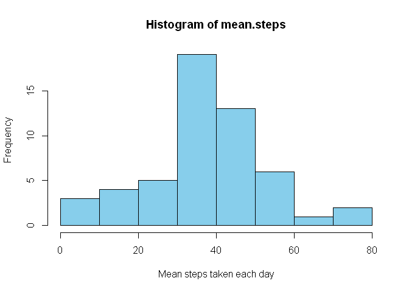

## Loading and preprocessing the data

```r
df <- read.csv("activity.csv")
df$date <- as.Date(df$date, "%Y-%m-%d")
str(df)
```

```
## 'data.frame':	17568 obs. of  3 variables:
##  $ steps   : int  NA NA NA NA NA NA NA NA NA NA ...
##  $ date    : Date, format: "2012-10-01" "2012-10-01" ...
##  $ interval: int  0 5 10 15 20 25 30 35 40 45 ...
```
## What is mean total number of steps taken per day?

Making a histogram of the total number of steps taken each day

```r
days <- unique(df$date)
mean.step.per.day <- tapply(df$steps,df$date, mean, na.rm=TRUE)
mdf <- data.frame(days, mean.steps = mean.step.per.day)
with(mdf, hist(mean.steps, xlab="Mean steps taken each day", ylab= "Frequency", col = "skyblue"))
```

<!-- -->

Calculating the mean and median of the mean steps per day

```r
mean(mdf$mean.steps, na.rm = T)
```

```
## [1] 37.3826
```

```r
median(mdf$mean.steps, na.rm = T)
```

```
## [1] 37.37847
```
## What is the average daily activity pattern?

Making a time series plot (i.e. type = "l") of the 5-minute interval (x-axis)
and the average number of steps taken, averaged across all days (y-axis)

```r
intervals <- unique(df$interval)
avg_steps <- tapply(df$steps, df$interval, mean, na.rm=TRUE)
plot(intervals, avg_steps, type="l",xlab= "Five minute intervals",ylab= "average steps", main="Average number of steps taken accross all days", col="red")
```

<!-- -->

Which 5-minute interval, on average across all the days in the dataset,
contains the maximum number of steps?

```r
intervals[which.max(avg_steps)]
```

```
## [1] 835
```
## Imputing missing values

There are a number of days/intervals where there are missing values
(coded as NA). The presence of missing days may introduce bias into some
calculations or summaries of the data.

Calculating the total number of missing values in the dataset
(i.e. the total number of rows with NAs)

```r
sum(is.na(df))
```

```
## [1] 2304
```

Filling in all of the missing values in the dataset

```r
nasteps <- is.na(df$steps)
stepsf <- df$steps
stepsf[nasteps] <- mean(stepsf, na.rm = TRUE)
naint <- is.na(df$interval)
intervalf <- df$interval
intervalf[naint] <- mean(intervalf, na.rm = TRUE)
any(is.na(intervalf)|is.na(stepsf))
```

```
## [1] FALSE
```
Creating a new dataset that is equal to the original dataset but with the
missing data filled in

```r
newdf <- data.frame(steps = stepsf, date = df$date, interval = intervalf)
head(newdf)
```

```
##     steps       date interval
## 1 37.3826 2012-10-01        0
## 2 37.3826 2012-10-01        5
## 3 37.3826 2012-10-01       10
## 4 37.3826 2012-10-01       15
## 5 37.3826 2012-10-01       20
## 6 37.3826 2012-10-01       25
```
Making a histogram of the total number of steps taken each day

```r
days <- unique(newdf$date)
total.step.per.day <- tapply(newdf$steps,newdf$date, sum)
tdf <- data.frame(days, total.steps = total.step.per.day)
with(tdf, hist(total.steps, xlab="Total steps taken each day", ylab= "Frequency", col = "pink"))
```

<!-- -->

Calculating mean and median total number of steps taken per day

```r
mean(total.step.per.day)
```

```
## [1] 10766.19
```


```r
median(total.step.per.day)
```

```
## [1] 10766.19
```
So, these values differ from the estimates from the first part of the assignment.

Without imputing the missing data the mean and median of the total steps would be as follows

```r
mean(tapply(df$steps,df$date, sum, na.rm=TRUE))
```

```
## [1] 9354.23
```

```r
median(tapply(df$steps,df$date, sum, na.rm=TRUE))
```

```
## [1] 10395
```
So, the median value is not much impacted due to the imputing of missing data
## Are there differences in activity patterns between weekdays and weekends?

Creating a new factor variable in the dataset with two levels – “weekday”
and “weekend” indicating whether a given date is a weekday or weekend
day

```r
newdf$week <- rep(0, dim(newdf)[1])
for(i in 1:dim(newdf)[1]){
    if(weekdays(newdf$date[i])=="Sunday"){
        newdf$week[i] <- "weekend"
    }
    else {
       newdf$week[i] <- "weekday"
    }
  
}
newdf$week <- as.factor(newdf$week)
str(newdf)
```

```
## 'data.frame':	17568 obs. of  4 variables:
##  $ steps   : num  37.4 37.4 37.4 37.4 37.4 ...
##  $ date    : Date, format: "2012-10-01" "2012-10-01" ...
##  $ interval: num  0 5 10 15 20 25 30 35 40 45 ...
##  $ week    : Factor w/ 2 levels "weekday","weekend": 1 1 1 1 1 1 1 1 1 1 ...
```

Making a panel plot containing a time series plot (i.e. type = "l") of the
5-minute interval (x-axis) and the average number of steps taken, averaged
across all weekday days or weekend days (y-axis)

```r
wdf <- newdf[newdf$week=="weekday",]
wenddf <- newdf[newdf$week=="weekend",]

intervals1 <- unique(wdf$interval)
avg_steps1 <- tapply(wdf$steps, wdf$interval, mean, na.rm=TRUE)

intervals2 <- unique(wenddf$interval)
avg_steps2 <- tapply(wenddf$steps, wenddf$interval, mean, na.rm=TRUE)

par(mfrow=c(2,1), mar=c(4,4,2,1))
plot(intervals2, avg_steps2, type="l",xlab= "Five minute intervals",ylab= "average steps", main="Average number of steps taken accross weekends", col="magenta")
plot(intervals1, avg_steps1, type="l",xlab= "Five minute intervals",ylab= "average steps", main="Average number of steps taken accross weekdays", col="blue")
```

<!-- -->
